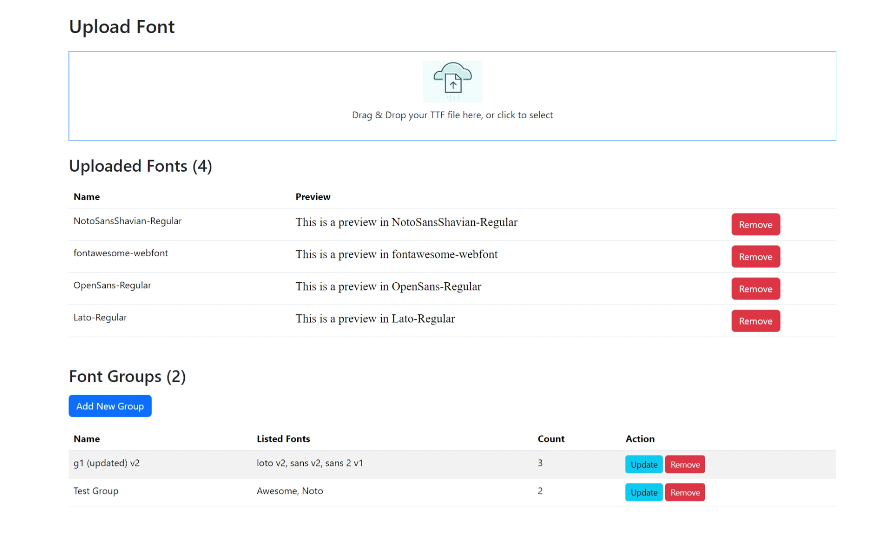
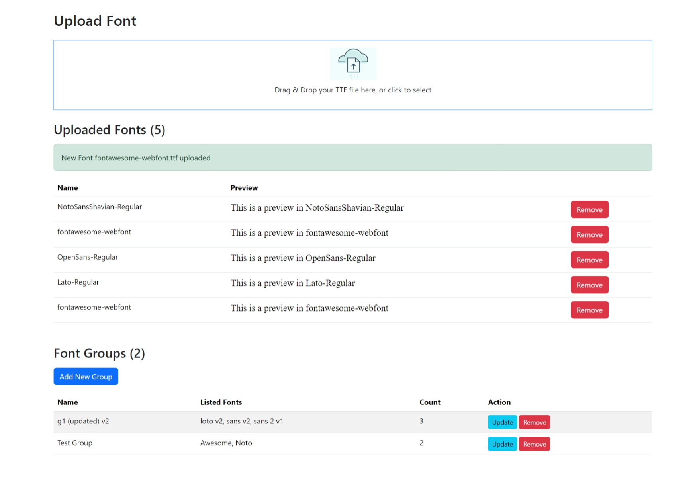
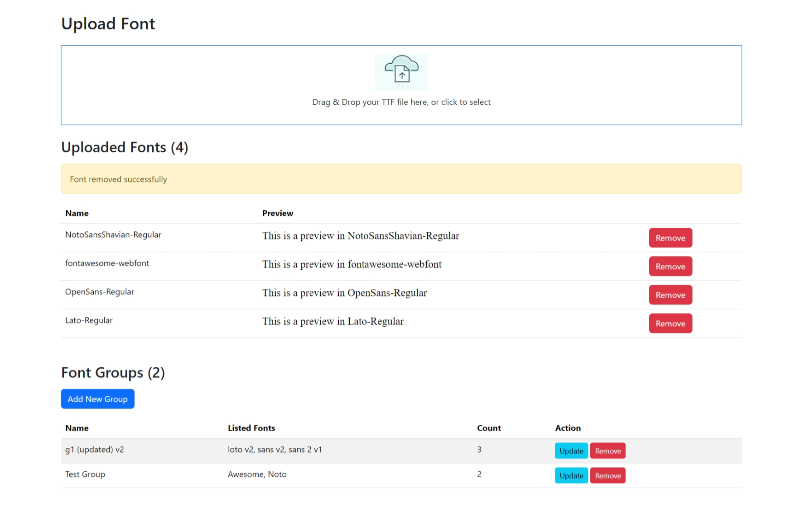
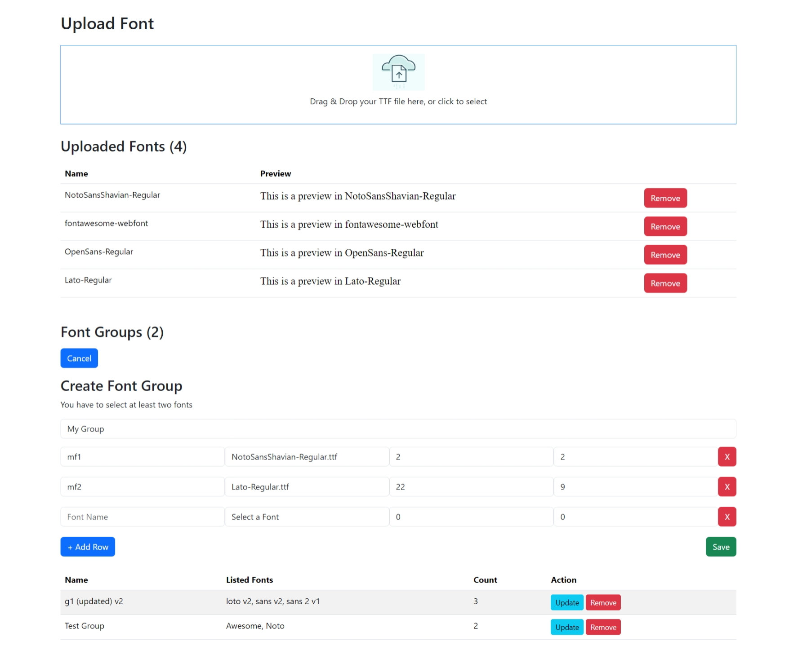
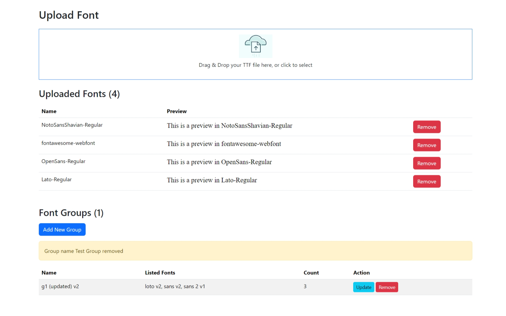

# Font Management System

This project allows users to upload, group, and manage fonts through a simple and intuitive interface.

## 1. System Overview

The system provides an overview of the font management interface, showing uploaded fonts, available font groups, and actions such as updating or removing fonts and groups.

## 2. Upload Font

Users can upload fonts by dragging and dropping TTF files or selecting them manually. Once uploaded, fonts will be listed with a preview and actions to remove them.

## 3. Remove Font

Fonts can be removed from the system, as shown here. The system confirms the font removal and updates the list of available fonts.

## 4. Save Font Group

Users can create font groups by selecting multiple fonts and saving them under a group name. These groups can then be updated or removed as needed.

## 5. Remove Font Group

Font groups can also be removed from the system. Once removed, the list of available groups will be updated.
